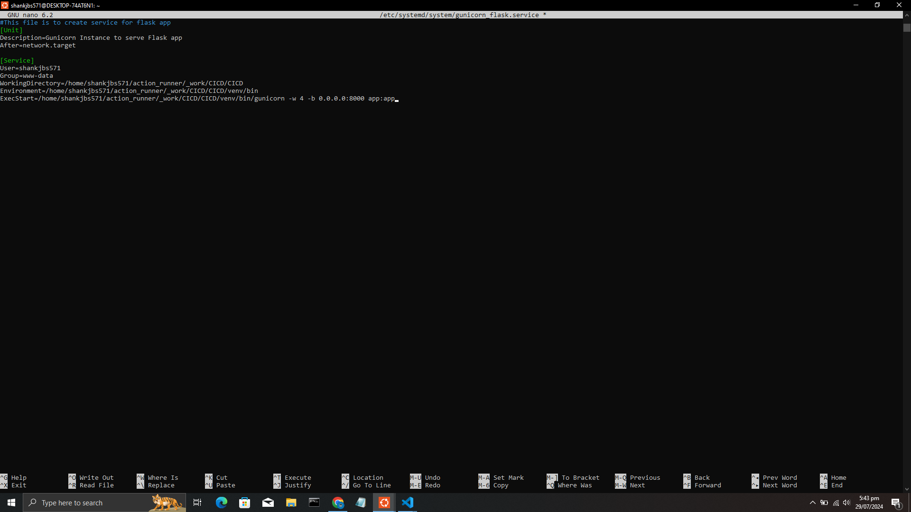
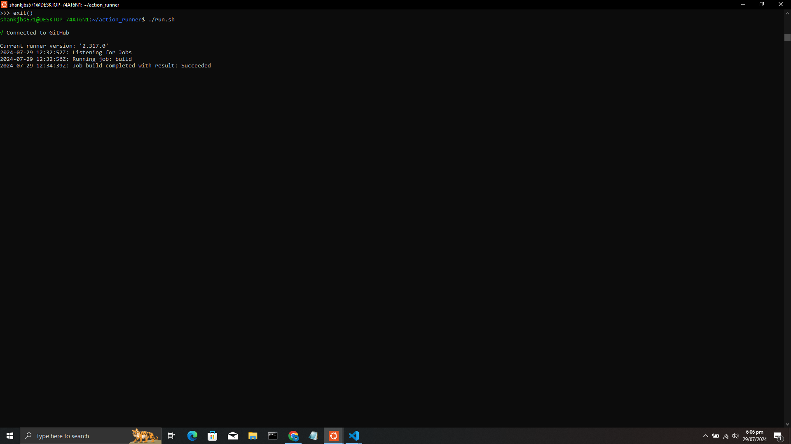
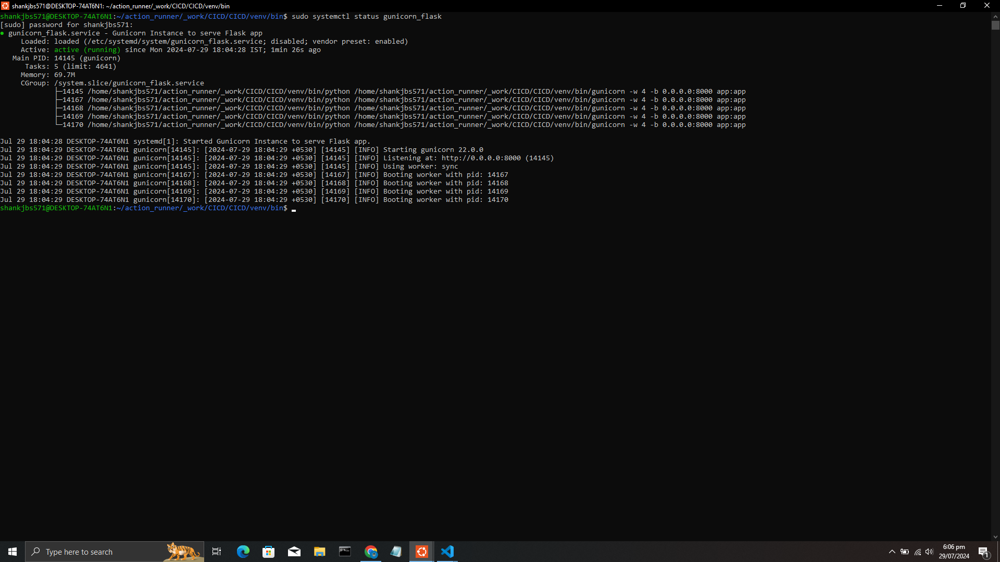
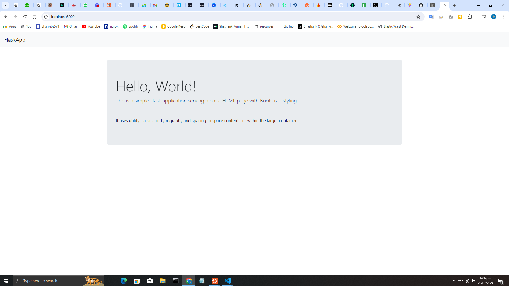
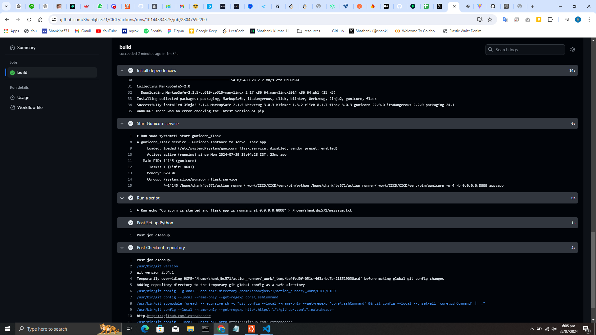
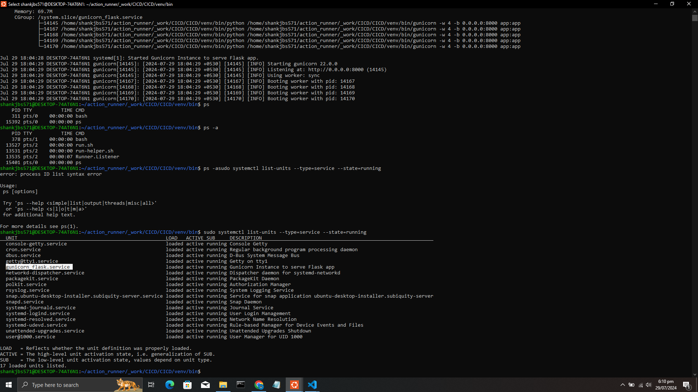
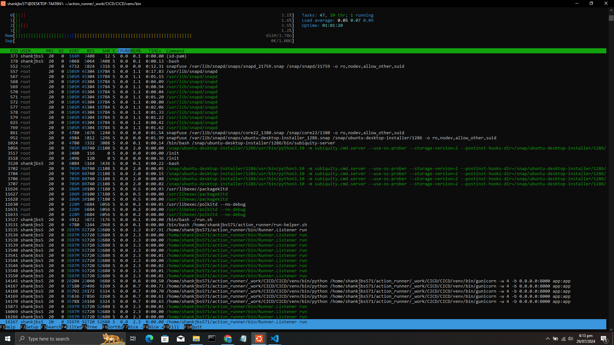

# Self-Hosted Runner Test Repository 🏃‍♂️

Welcome to the Self-Hosted Runner Test Repository! 🚀 This repo is set up to explore and document the process of using a self-hosted runner with GitHub Actions. It's a project born out of curiosity and serves as a hands-on experiment to understand how self-hosted runners communicate with GitHub Actions workflows.

## 📸 Screenshots

Here are some screenshots documenting the setup and testing process:

